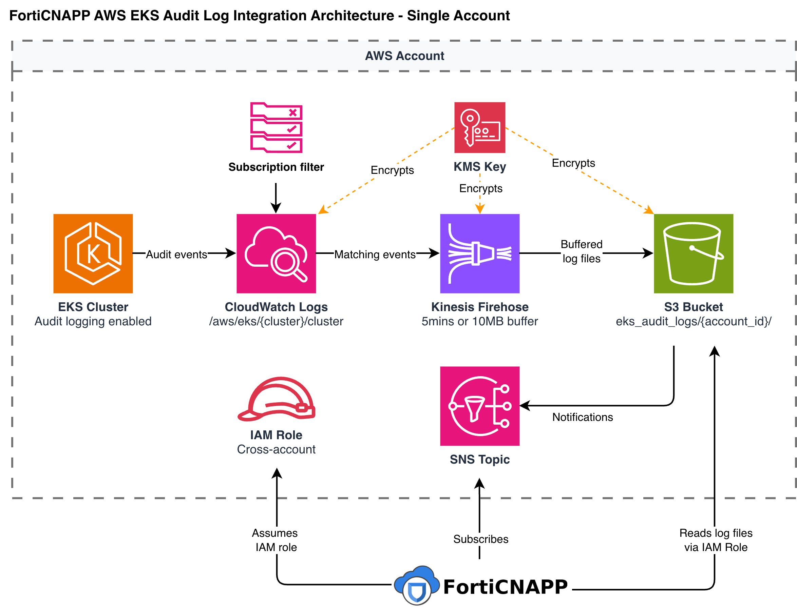

# Lacework AWS EKS Audit Log Integration

## Overview

This integration enables Lacework to monitor Kubernetes control plane activity across your EKS clusters for security threats. Lacework receives EKS API server audit logs — capturing every `kubectl` command, pod creation, RBAC change, privilege escalation attempt, and other Kubernetes API activity — and analyzes them for anomalies and policy violations.

This is distinct from the [CloudTrail integration](../../terraform-aws-cloudtrail/docs/architecture-org.md) (which covers AWS API calls) and the [Config integration](../../terraform-aws-org-configuration/docs/README.md) (which assesses resource configurations). EKS audit logs provide visibility into the Kubernetes data plane: who ran what inside your clusters.

**Prerequisite**: EKS audit logging must be enabled on each cluster before this integration can receive events. The module does not enable it automatically — enable it with:

```bash
aws eks update-cluster-config --name <cluster_name> \
  --logging '{"clusterLogging":[{"types":["audit"],"enabled":true}]}'
```

---

## Architecture

All resources are created in the same AWS account and region where Terraform is applied. There is no cross-account deployment — the pipeline runs entirely within your account.



EKS writes audit events to CloudWatch Logs. A subscription filter on each cluster's log group forwards events to Kinesis Firehose, which buffers and writes them to S3. S3 notifies an SNS topic when new objects arrive, and Lacework — subscribed to that topic — fetches and processes the logs.

---

## How the Integration Is Established

When `terraform apply` runs:

### 1. S3 Bucket

A private S3 bucket is created to store audit log files. Versioning is enabled and all public access is blocked. S3 event notifications are configured to publish to the SNS topic whenever a new object is created under the `eks_audit_logs/{account_id}/` prefix.

### 2. KMS Key

A customer-managed KMS key is created to encrypt S3 objects, Firehose records, and the SNS topic end-to-end. The key policy grants access to the Firehose service, the SNS service, and Lacework's platform role — and to no other external principals.

### 3. Kinesis Firehose Delivery Stream

A Firehose delivery stream is created with an extended S3 destination. It buffers incoming log records and flushes to S3 every **5 minutes** or when **100 MB** accumulates, whichever comes first. This batching reduces S3 write frequency and SNS notification volume.

### 4. SNS Topic

An SNS topic receives the S3 ObjectCreated notifications. Its access policy allows:
- `s3.amazonaws.com` to publish events from this specific bucket.
- Lacework's platform role (account `434813966438`) to subscribe.

### 5. Three IAM Roles

| Role | Trust | Permissions |
|---|---|---|
| Firehose role | `firehose.amazonaws.com` | `s3:PutObject` on `eks_audit_logs/{account_id}/*` |
| CloudWatch role | `logs.{region}.amazonaws.com` (for each region in `cloudwatch_regions`) | `firehose:PutRecord`, `firehose:PutRecordBatch` on this stream |
| Cross-account role | Lacework platform (`434813966438`) + External ID | Read S3, subscribe to SNS (see table below) |

### 6. CloudWatch Log Subscription Filters

One subscription filter is created per cluster in `cluster_names`. Each filter attaches to the log group `/aws/eks/{cluster_name}/cluster` and routes matching events to the Firehose stream. The default filter pattern passes only meaningful Kubernetes API server audit events — health check traffic, readiness probes, and EC2 metadata endpoint calls are excluded to reduce noise and cost.

### 7. Lacework Integration Registered

After a 20-second wait for IAM propagation, the Lacework Terraform provider registers the integration via the Lacework API, supplying the cross-account role ARN, External ID, S3 bucket ARN, and SNS topic ARN. From this point, Lacework begins receiving and analyzing EKS audit events.

---

## How EKS Audit Logs Reach Lacework

1. A Kubernetes API call occurs in an EKS cluster — for example, `kubectl exec` into a pod, creation of a ClusterRoleBinding, or a `kubectl delete` on a production workload.
2. The EKS control plane records the audit event and writes it to CloudWatch Logs under `/aws/eks/{cluster_name}/cluster`.
3. The CloudWatch subscription filter evaluates the event against the filter pattern. Matching events are forwarded to the Kinesis Firehose delivery stream in real time.
4. Firehose accumulates records until the 5-minute window or 100 MB buffer is reached, then writes the batch as a file to S3 at `eks_audit_logs/{account_id}/`.
5. S3 publishes an `ObjectCreated` notification to the SNS topic.
6. Lacework's platform — subscribed to the SNS topic — receives the notification, reads the S3 object, and processes the audit events for threat detection.

---

## How Lacework Accesses Your Logs

The cross-account IAM role trusts Lacework's platform AWS account (`434813966438`). The trust policy requires a unique **External ID** generated at deploy time, preventing [confused-deputy attacks](https://docs.aws.amazon.com/IAM/latest/UserGuide/confused-deputy.html).

The role is read-only:

| Permission | Scope | Purpose |
|---|---|---|
| `s3:GetObject` | Audit log bucket | Read log files written by Firehose |
| `sns:GetTopicAttributes`, `sns:Subscribe`, `sns:Unsubscribe` | SNS topic | Subscribe to S3 delivery notifications |
| `iam:ListAccountAliases` | All resources | Identify the account in the Lacework console |

No write, delete, or mutating permissions are granted. The role cannot modify your EKS clusters, CloudWatch logs, or any other AWS resource.

**Optional debug permissions** (`allow_debugging_permissions = true`): adds read-only diagnostics (`eks:ListClusters`, `logs:DescribeLogGroups`, `logs:DescribeSubscriptionFilters`, `firehose:ListDeliveryStreams`, `firehose:DescribeDeliveryStream`, `s3:GetBucket*`) to help Lacework support diagnose pipeline issues.

---

## Adding More Clusters

To bring additional clusters into the integration, add their names to the `cluster_names` variable and re-apply. The module creates one new CloudWatch subscription filter per added cluster — all pointing to the same Firehose stream, S3 bucket, and SNS topic. No new IAM roles or storage infrastructure is provisioned.

Ensure EKS audit logging is enabled on the cluster before adding it.

---

## Multi-Region Setup

When clusters span multiple AWS regions:

1. Set `cloudwatch_regions` to include every region where clusters live. This broadens the CloudWatch IAM role's trust policy to accept calls from CloudWatch Logs in those regions.
2. Set `no_cw_subscription_filter = true` to skip automatic subscription filter creation.
3. Create subscription filters manually in each region, pointing their destination to the Firehose ARN (from the `firehose_arn` output). All regions funnel into the same S3 bucket and SNS topic.

See `examples/multi_region/` for a working example.

---

## Security Design

**Three tightly scoped IAM roles**
Each service role is limited to exactly what it needs. Firehose can only write to the S3 audit prefix. CloudWatch can only put records to this specific Firehose stream. The cross-account role has no write or delete permissions of any kind.

**KMS encryption end-to-end**
Firehose records, S3 objects, and SNS messages are all encrypted with the same KMS key. The key policy grants encryption/decryption only to the AWS services in the pipeline and to Lacework's platform role — no other external principals.

**External ID protection**
The cross-account role requires a unique External ID at assume-role time. This prevents a confused-deputy attack where a third party could trick Lacework into accessing your account using Lacework's own credentials.

**S3 public access blocked**
All public access is disabled on both the audit log bucket and the optional access log bucket.

**Scoped S3 event notification**
SNS only receives notifications for objects under `eks_audit_logs/{account_id}/` — not for the entire bucket.

**Signal noise reduction**
The default CloudWatch subscription filter excludes health checks, readiness probes, and EC2 metadata endpoint calls. This reduces storage usage and ensures Lacework only processes meaningful Kubernetes API activity.

---

## Troubleshooting

**No audit events appearing in Lacework**
Confirm EKS audit logging is enabled: `aws eks describe-cluster --name <name> --query 'cluster.logging'`. Then verify the CloudWatch log group `/aws/eks/{cluster_name}/cluster` is receiving records. If the log group is absent, audit logging has not been enabled.

**CloudWatch subscription filter not delivering events**
Check that the `cloudwatch_regions` variable includes the region where the cluster lives. The CloudWatch IAM role's trust policy only allows calls from the listed regions — requests from unlisted regions are denied.

**Firehose delivery failures**
Inspect the Firehose error prefix in S3 at `audit_logs/{account_id}/error/`. Errors appear there with the reason. Common causes: the Firehose IAM role lacks `kms:GenerateDataKey` on the KMS key, or the S3 bucket policy has an unexpected restriction.

**Lacework not receiving SNS notifications**
Verify the SNS topic access policy allows `s3.amazonaws.com` to publish from this bucket and allows the Lacework platform account (`434813966438`) to subscribe. Also confirm the S3 bucket notification configuration references the correct SNS topic ARN.

**External ID mismatch**
If the cross-account IAM role was deleted and recreated (for example, after a `terraform destroy` / re-apply), a new External ID is generated. Re-apply to push the updated External ID to the Lacework integration and resync the trust relationship.

**KMS decryption errors from Lacework**
The KMS key policy must grant `kms:Decrypt` and `kms:GenerateDataKey` to Lacework's platform account (`434813966438`). Check the key policy in the AWS KMS console if Lacework reports decryption failures.
